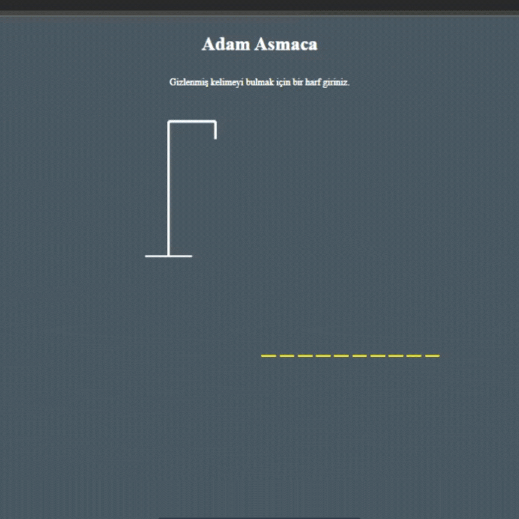

<h1>HangMan</h1>
<h2>About Project:</h2>

-There is a structure that brings random words every time the page is loaded 
-Warns when the same letter is entered for the 2nd time, 
-Every time an incorrect letter is entered, the icon's head, arms, body and feet are formed. 
-When the selected word is known, the warning box "you have won", and when you do not know it, the warning box "you have lost" appears. 
-When we say play again, it resets and creates a new word.
-SVG file format was used for application design.

<h3> Technologies Used: </h3>
-Html
-CSS
-JavaScript

<h4>Project Gif: </h4>

